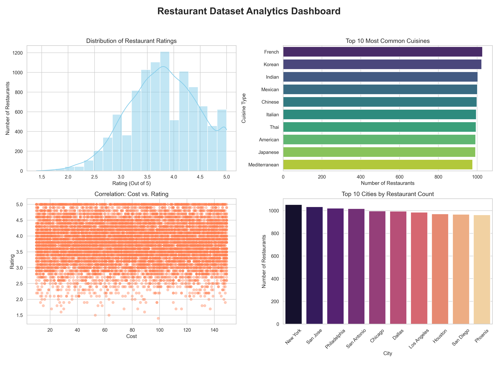

# 🍽️ Restaurant Analytics Dashboard

## 📊 Project Overview
This project is an **end-to-end Restaurant Data Analysis & Visualization Dashboard** that explores insights from restaurant datasets using both:

- 🐍 **Python (Data Analysis + Visualization)**
- 🌐 **Web Dashboard (Interactive UI with Chart.js & Vite)**

It analyzes restaurant data such as **ratings, cuisines, cost, and city distribution** to generate meaningful business insights.

---

## 🖼️ Dashboard Preview


---

## 🚀 Key Features

### 📌 Data Analysis (Python)
- Data cleaning (duplicates & missing values handling)
- Statistical summary (min, max, average)
- Visualization dashboard with:
  - Rating distribution (Histogram)
  - Top cuisines (Bar chart)
  - Cost vs Rating (Scatter plot)
  - Top cities (Bar chart)

---

### 🌐 Interactive Web Dashboard
- KPI Cards (Total Restaurants, Avg Rating, Avg Cost, Top City, Top Cuisine)
- Filters:
  - City
  - Cuisine
  - Rating range
  - Cost range
- Charts:
  - Ratings distribution
  - Cuisine analysis
  - Cost vs Rating
  - City-wise restaurants
- Searchable & sortable data table
- Pagination support

---

### 🧪 Dataset Generation
- Generates **10,000 synthetic restaurant records**
- Includes:
  - City
  - Cuisine
  - Rating
  - Cost
  - Votes

---

## 🛠️ Technologies Used

### 🔹 Python Stack
- Pandas
- NumPy
- Matplotlib
- Seaborn

### 🔹 Frontend Stack
- HTML, CSS, JavaScript
- Chart.js
- Vite

---

## 📂 Project Structure
Restaurant-Analytics-Dashboard/
│── restaurant_analysis.py
│── generate_dummy_data.py
│── restaurant_data.csv
│── restaurant_dashboard.png
│
├── web/
│ ├── index.html
│ ├── src/
│ │ ├── main.js
│ │ ├── style.css
│
├── package.json
├── README.md

---

## ⚙️ Installation & Setup

### 🔹 1. Clone the Repository
```bash
git clone https://github.com/your-username/restaurant-analytics-dashboard.git
cd restaurant-analytics-dashboard
---


